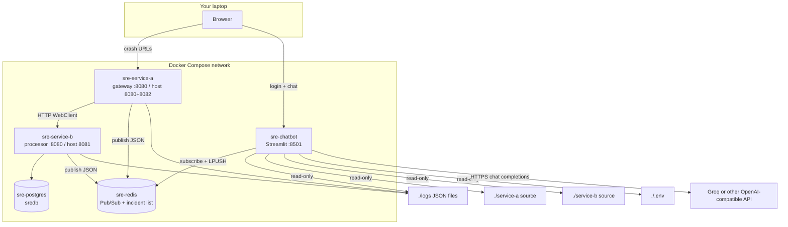
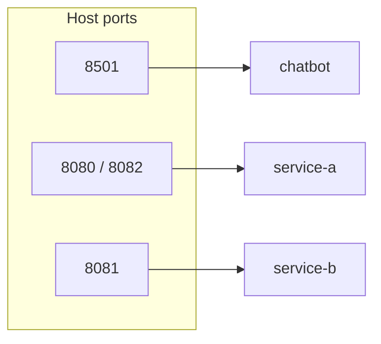
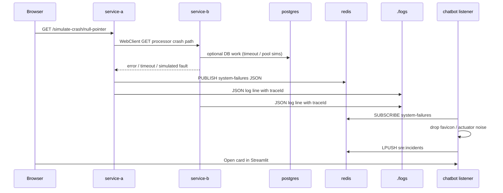
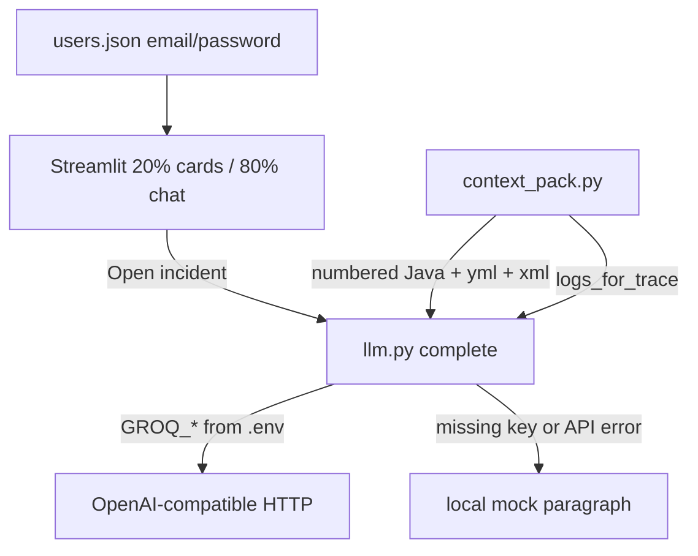
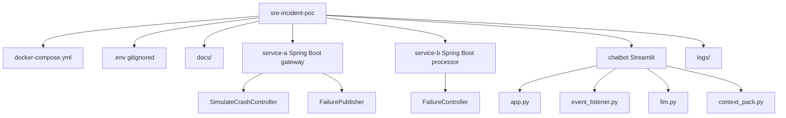

# Project architecture and runtime flow

Local proof-of-concept: two Spring Boot 3 microservices, Redis as an incident bus, Postgres for Service-B data, and a Streamlit “incident copilot” that packs **this repo’s Java + logs** into an LLM prompt. No Cursor is required at runtime — only Docker Compose.

---

## Containers and ports

| Container | Image / build | Role | Host ports |
| --- | --- | --- | --- |
| `sre-redis` | `redis:7-alpine` | Pub/Sub channel `system-failures`; list `sre:incidents` | 6379 |
| `sre-postgres` | `postgres:16-alpine` | Service-B orders / JPA | 5432 |
| `sre-service-b` | `./service-b` | Failure simulators, DB, Redis publish | **8081** → container 8080 |
| `sre-service-a` | `./service-a` | Gateway, Resilience4j, crash routes, Redis publish | **8080** and **8082** |
| `sre-chatbot` | `./chatbot` | Login, incident sidebar, Groq/mock chat | **8501** |

Inside Compose, services talk by **DNS name** (`postgres`, `redis`, `service-b`), never `localhost`. `localhost` is only for the browser on the same machine.

---

## Crash and incident pipeline

Hitting a demo URL on Service-A (example: `/simulate-crash/null-pointer`) proxies to Service-B, which throws a simulated failure. Exceptions are published as JSON to Redis. The chatbot listener stores a card and later packs matching logs + ranked source files for the LLM.

Failure JSON fields used across the stack: `timestamp`, `serviceName`, `traceId`, `correlationId`, `errorType`, `message`.

**Ten gateway routes** (Service-A `SimulateCrashController` → Service-B `FailureController`):

1. `null-pointer` — NPE on null profile `toUpperCase()`
2. `db-timeout` — pool / SQL timeout simulation
3. `kafka-drop`
4. `out-of-memory`
5. `auth-lock` — shared `INTERNAL_API_KEY`
6. `deadlock`
7. `bad-payload`
8. `rate-limit`
9. `disk-full`
10. `circuit-breaker` — Resilience4j on Service-A after retries

`ALLOW_Display=False` in `.env` puts Service-A in maintenance (HTML) and the chatbot drops ingest so the demo can show “site down.”

---

## Chatbot UI and LLM investigation

On **Open**:

1. Session stores the incident JSON.
2. First user turn asks for a four-section RCA (impact, faulty lines, business, ETTR).
3. `investigation_context` mounts `CODE_ROOTS` (`/code/service-a` and `/code/service-b`) and scores files (controllers named *Fail* / *Simulate* rank higher).
4. Listings include **repo-relative paths and line numbers** so the model can name `service-b/src/main/java/.../FailureController.java`.
5. Follow-ups use a shorter system prompt (do not repeat the four sections unless asked).

Jira and hotfix buttons are **UI stubs** (toasts), not real ticketing or CI.

---

## Source layout (what lives where)

| Path | Responsibility |
| --- | --- |
| `service-a/.../SimulateCrashController.java` | Public crash URLs, proxy to B |
| `service-a/.../FailurePublisher.java` | Redis publish |
| `service-a/.../MaintenanceFilter.java` | `ALLOW_Display` |
| `service-b/.../FailureController.java` | Simulated faults |
| `chatbot/event_listener.py` | Redis → incident list |
| `chatbot/log_collector.py` | Correlate `./logs` by `traceId` |
| `chatbot/context_pack.py` | Rank and number source for the prompt |
| `chatbot/llm.py` | Groq/OpenAI-compatible call + mock fallback |
| `chatbot/users.json` | Demo logins (not `.env`) |

---

## Data that never goes through the LLM

Postgres order rows, Redis Pub/Sub plumbing, and HTTP between A and B are **unchanged** by `GROQ_MODEL`. The model only sees what `llm.py` puts in the chat-completions request: system prompt + packed files + logs + the Streamlit message history.
