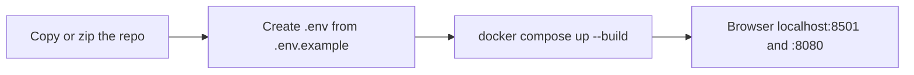

# Run this stack on another laptop (Docker only, no Cursor)

You need **Docker Desktop** (or Docker Engine + Compose v2) and a copy of this project folder. You do **not** need Java, Maven, Python, or Cursor.



---

## 1. Copy the project

Bring the whole directory, including:

- `docker-compose.yml`
- `service-a/`, `service-b/`, `chatbot/`
- `chatbot/users.json` (demo logins)
- `.env.example` (template)
- empty `logs/` with `.gitkeep` if present

You can omit `logs/*.log` and Cursor metadata (`.cursor/`). **Do not** rely on someone else’s `.env` (it is gitignored and may contain API keys).

On the new machine:

```bash
cd sre-incident-poc
cp .env.example .env
```

Then edit `.env` with a text editor. Values below are the ones this Compose file actually consumes.

---

## 2. Required vs optional `.env` keys

Compose always interpolates `${VAR}` from `.env` in the **same folder** as `docker-compose.yml`. The chatbot and Service-A also **mount** `.env` at `/config/.env` so `ALLOW_Display` and LLM settings can be re-read without rebuilding Java.

| Variable | Required to boot? | Used by | What to put |
| --- | --- | --- | --- |
| `GROQ_API_KEY` | No | chatbot | Groq key from https://console.groq.com/keys (starts with `gsk_`). Empty = local mock answers, stack still runs. |
| `GROQ_MODEL` | No | chatbot | Groq (or other) **model id**. Default if omitted: `openai/gpt-oss-20b`. |
| `GROQ_BASE_URL` | No | chatbot | OpenAI-compatible base URL. Default: `https://api.groq.com/openai/v1`. See [swap-llm-model.md](swap-llm-model.md). |
| `ALLOW_Display` | No | service-a + chatbot | `True` = normal site. `False` = maintenance page and **no** new incident ingest. |
| `INTERNAL_API_KEY` | No | service-a + service-b | Shared secret for the **auth-lock** crash demo. Default in Compose: `poc-internal-key`. Set the **same** value on both if you change it. |

### Minimal `.env` that boots everything (mock LLM)

```bash
ALLOW_Display=True
INTERNAL_API_KEY=poc-internal-key
GROQ_API_KEY=
GROQ_MODEL=openai/gpt-oss-20b
GROQ_BASE_URL=https://api.groq.com/openai/v1
```

### Minimal `.env` with live Groq answers

```bash
ALLOW_Display=True
INTERNAL_API_KEY=poc-internal-key
GROQ_API_KEY=gsk_paste_your_new_key
GROQ_MODEL=openai/gpt-oss-20b
GROQ_BASE_URL=https://api.groq.com/openai/v1
```

Create a **new** Groq key on the other laptop’s account if you cannot share secrets. Do not commit `.env`.

---

## 3. Not in `.env` (Compose defaults — copy only if you change them)

These are hardcoded in `docker-compose.yml` / `application.yml`. You do **not** put them in `.env` unless you edit Compose.

| Setting | Default | Notes |
| --- | --- | --- |
| Postgres database | `sredb` | User `sre`, password `sre` |
| Redis | host `redis` port `6379` | Compose DNS |
| Failure channel | `system-failures` | Must stay in sync if you ever rename it |
| Processor URL | `http://service-b:8080` | Internal only |
| Chatbot `CODE_ROOTS` | `/code/service-a:/code/service-b` | Bind mounts of the Java trees |
| Demo logins | `chatbot/users.json` | `sre@local.dev` / `ChangeMe123!` and `demo@local.dev` / `demo123` |

`DEMO_EMAIL` / `DEMO_PASSWORD` are **not** read by the app. Change logins by editing `chatbot/users.json`, then recreate the chatbot (that file is bind-mounted).

---

## 4. Start and verify

From the project root (Docker must be running):

```bash
docker compose up --build
```

First build downloads images and Maven-packages both JARs (several minutes). Leave the terminal open.

| Check | URL / command |
| --- | --- |
| Chatbot login | http://localhost:8501 |
| Gateway crash page / APIs | http://localhost:8080 |
| Processor health | http://localhost:8081/actuator/health |
| Sample incident | http://localhost:8080/simulate-crash/null-pointer |

The other laptop must have **those host ports free** (8501, 8080, 8081, 8082, 6379, 5432). If a port is taken, change the **left** side of `ports:` in `docker-compose.yml` only (example `"8502:8501"`), not the container’s internal port.

Stop: `Ctrl+C`, then `docker compose down`. Keep Postgres data: omit `-v`. Wipe DB: `docker compose down -v`.

---

## 5. Network notes for a second machine

- Open **http://localhost:…** on **that** machine’s browser. Do not change `redis` / `postgres` / `service-b` hostnames in YAML to `localhost` — those names work only **inside** the Compose network.
- `SERVICE_A_PUBLIC_URL` in Compose is `http://localhost:8080` for captions in the UI. If you access the UI from another device on the LAN, you may still trigger crashes from the Docker host’s 8080.
- Groq/OpenAI calls need **outbound HTTPS** from the chatbot container. Offline laptops still run the stack; chat uses the mock if the key is empty or the API errors.
- Free-tier Groq **tokens-per-minute** can be lower than the packed source size (~16k tokens). That is an API limit, not a missing `.env` field. Workaround: another model/tier ([swap-llm-model.md](swap-llm-model.md)) or a smaller pack in `context_pack.py`.

---

## 6. Checklist before you hand the folder to someone else

- [ ] `.env` exists (copied from `.env.example`)
- [ ] `GROQ_API_KEY` filled **or** they accept mock chat
- [ ] `ALLOW_Display=True` unless they want maintenance mode
- [ ] `INTERNAL_API_KEY` same for A and B (or leave default)
- [ ] Docker Desktop started
- [ ] `docker compose up --build` from the folder that contains `docker-compose.yml`
- [ ] Browser: 8501 login, then 8080 crash URL, then **Open** on the new card
