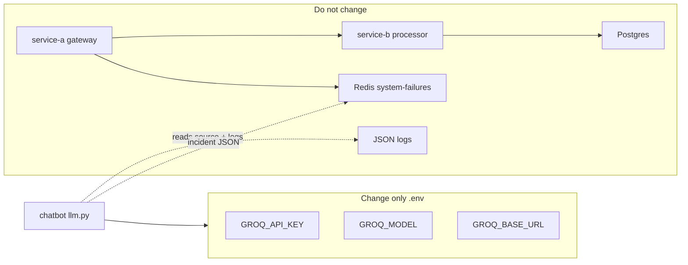

# Swap the chat LLM without touching business logic

The Java services, Redis Pub/Sub, Postgres, crash URLs, incident cards, and log files **do not know which model you use**. Only the chatbot’s chat completion call reads `GROQ_*` from `.env`.

Do **not** edit `service-a`, `service-b`, `FailureController`, Redis channel names, or Streamlit UI layout to change a model.



---

## 1. Same provider (Groq): change the model id

1. Open `.env` next to `docker-compose.yml`.
2. Set a Groq model id from [Groq models](https://console.groq.com/docs/models):

```bash
GROQ_API_KEY=gsk_your_key_here
GROQ_MODEL=llama-3.3-70b-versatile
GROQ_BASE_URL=https://api.groq.com/openai/v1
```

3. Save the file. The chatbot reads `/config/.env` on each question, so a rebuild is usually unnecessary.
4. If Compose was started before you added the key, recreate the chatbot so the container env matches:

```bash
docker compose up -d chatbot
```

5. Hard-refresh http://localhost:8501 and ask again.

Examples of `GROQ_MODEL` values (copy the **exact** id Groq lists):

| Intent | Typical id |
| --- | --- |
| Default in this POC | `openai/gpt-oss-20b` |
| Larger Groq OSS | `openai/gpt-oss-120b` |
| Fast small Llama | `llama-3.1-8b-instant` |
| Stronger Llama | `llama-3.3-70b-versatile` |

If the id is retired or 404, `chatbot/llm.py` tries a short fallback list. Rate-limit / “request too large” errors are **not** retried — pick a model whose **tokens-per-minute** is larger than the packed source (~15k+ tokens on this repo) or shrink is a separate change in `context_pack.py` (still chatbot-only).

---

## 2. Another OpenAI-compatible API (OpenAI, Azure OpenAI, Ollama, etc.)

The client is the official `openai` Python SDK pointed at `GROQ_BASE_URL`. Any host that implements `/v1/chat/completions` works **without Java or Redis changes**.

Keep the same variable **names** (`GROQ_API_KEY`, `GROQ_MODEL`, `GROQ_BASE_URL`) so you do not touch `docker-compose.yml` business services.

### OpenAI platform

```bash
GROQ_API_KEY=sk-your_openai_key
GROQ_MODEL=gpt-4o-mini
GROQ_BASE_URL=https://api.openai.com/v1
```

### Azure OpenAI

Use your resource’s chat-completions base URL (no trailing path beyond `/v1` if that is what Azure documents for the OpenAI-compatible endpoint) and the **deployment name** as the model:

```bash
GROQ_API_KEY=your_azure_key
GROQ_MODEL=your-deployment-name
GROQ_BASE_URL=https://YOUR_RESOURCE.openai.azure.com/openai/v1
```

(If Azure requires an `api-version` query, use the base URL Azure documents for the v1-compatible API.)

### Local Ollama

Ollama’s OpenAI shim (typical):

```bash
GROQ_API_KEY=ollama
GROQ_MODEL=llama3.2
GROQ_BASE_URL=http://host.docker.internal:11434/v1
```

`host.docker.internal` is the laptop from inside Docker Desktop (Mac/Windows). On Linux you may need `extra_hosts` or the host IP. Ollama must be running **on the laptop**; it is not started by this Compose file.

Then:

```bash
docker compose up -d chatbot
```

---

## 3. What you must not change

| Area | Why |
| --- | --- |
| Crash URLs / controllers | Incident generation is independent of the LLM |
| Redis channel `system-failures` | Listener and publishers would desync |
| Postgres / JPA | Order data for failure simulators |
| `CODE_ROOTS` / log mounts | Investigation context, not the model name |
| Streamlit `complete()` call | Already model-agnostic |

Optional (still not Java): edit only `chatbot/llm.py` if you want a new **default** when `.env` is empty, or to change the Groq-only fallback id list `_GROQ_MODELS`.

---

## 4. How to tell it worked

- Chatbot caption shows **LLM: Groq** when `GROQ_API_KEY` is non-empty (the label is historical; it means “remote OpenAI-compatible client is configured”).
- A follow-up question such as “which file should I change?” should **not** append `(Groq error: ...)`.
- If Groq/OpenAI fails, the UI stays up and appends a mock SRE paragraph plus the error — that is not a Java failure.
